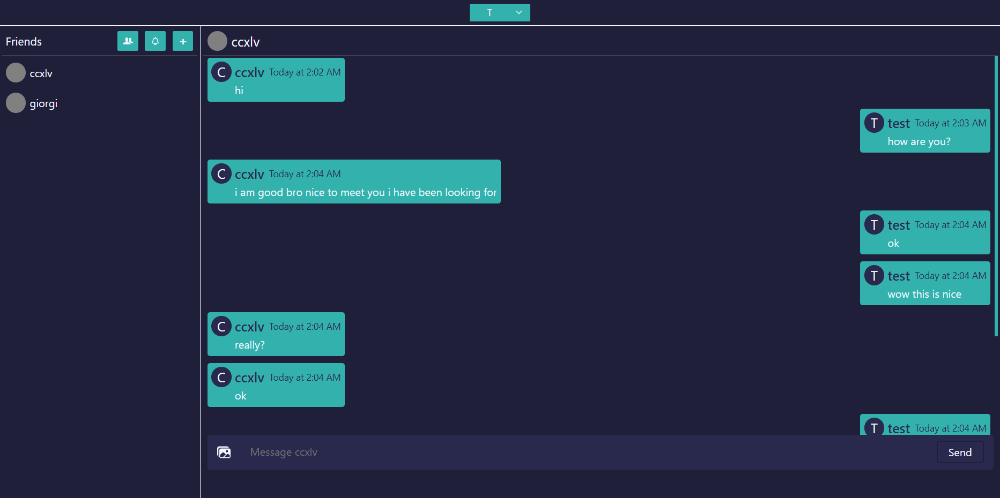

# Chat website with flask restful api in the backend and react in the frontend

using sqlite3 for storing friends and redis for storing messages



```cmd
pip install -r requirements.txt
flask init_db
flask populate_db
```

```cmd
cd frontend
npm i
```

```cmd
python app.py
```

```
cd frontend
npm start
```